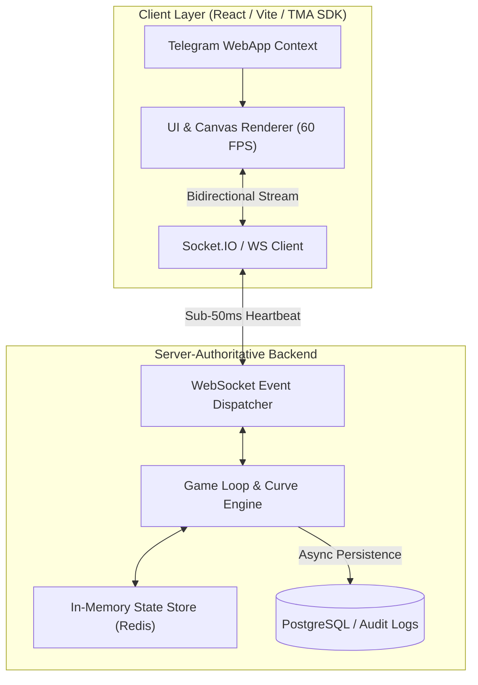

# 🚀 Astro Crash — Real-Time Event-Driven Telegram Mini App & Game Engine

[](https://www.typescriptlang.org/)
[](https://reactjs.org/)
[](https://developer.mozilla.org/en-US/docs/Web/API/WebSockets_API)
[](https://core.telegram.org/bots/webapps)

A high-performance, server-authoritative real-time web application and Telegram Mini App (TMA). Built for sub-50ms state synchronization, continuous event streaming, and resilient client-side animation pipelines.

---

## 🏛️ System Architecture



---

## ✨ Key Features

- **Server-Authoritative Game Loop:** Zero client-side manipulation. Multipliers, crash curves, and round states are calculated and verified exclusively on the server.
- **Low-Latency Event Streaming:** Bidirectional WebSocket pipelines broadcasting round lifecycle (Waiting, Active, Crashed) to thousands of concurrent users.
- **Telegram Mini App Integration:** Seamless authentication via Telegram initData HMAC validation, native viewport resizing, and haptic feedback.
- **Smooth 60 FPS Visuals:** Canvas and CSS animation pipelines designed for zero stutter across both mobile and desktop browsers.

---

## 🛠️ Tech Stack

- **Frontend:** React.js, TypeScript, Vite, Tailwind CSS, Telegram WebApp SDK
- **Backend & Real-Time:** Node.js, Express, Socket.IO / WebSockets, TypeScript
- **State & Database:** Redis (active game state), PostgreSQL (user history & transactions)
- **Deployment:** Docker, Nginx reverse proxy

---

## ⚡ Quick Start

```bash
# Clone the repository
git clone git@github.com:yevhens-hue/astro-crash.git
cd astro-crash

# Install dependencies
npm install

# Start local development server
npm run dev
```

---

## 👨‍💻 Author & Architecture
- **Author:** [Yevhen Shaforostov](https://github.com/yevhens-hue)
- **Role:** AI Product Manager & Full-Stack AI Engineer at [Adsy.com](https://adsy.com)


<!-- activity-sync: 2026-08-28 -->
